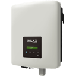

# ioBroker.solax-x1-mini-rs485

[](https://www.npmjs.com/package/iobroker.solax-x1-mini-rs485)
[](https://www.npmjs.com/package/iobroker.solax-x1-mini-rs485)


[](https://david-dm.org/Andy200877/iobroker.solax-x1-mini-rs485)
[](https://snyk.io/test/github/Andy200877/ioBroker.solax-x1-mini-rs485)

[](https://nodei.co/npm/iobroker.solax-x1-mini-rs485/)

## solax-x1-mini-rs485 adapter for ioBroker

Livedaten des Solax X1 mini Wechselrichters über RS485

## Developer manual
Dieser Adapter ist ausschließlich für den Solax X1 mini Wechselrichter.

Mit diesem Adapter werden alle wichtigen Daten aus der Modbus-Schnittstelle des Wechselrichters ausgelesen.

Der Adapter holt sich in einem einstellbaren Intervall alle Daten aus dem Wechselrichter.
PV-Spannung / Strom, Temperatur, Werte der AC Seite Spannung/Strom/Frequenz, Betriebsmodus,...

Natürlich antwortet der Wechselrichter auch nur, wenn er sich eingeschaltet hat.
Abends / Nachts (wenn keine Sonne scheint) schaltet sich der Solax X1 mini Wechselrichter komplett ab und antwortet dann natürlich nicht.


<b>Benötigte Hardware</b>

 - Solax X1 Mini Wechselrichter

 - USB zu RS485 Konverter https://amzn.to/3HAuN0k

 - altes Netzwerkkabel / Cat. Kabel mit RJ45 Stecker
 

<b>Hardware Anschluss</b>
Ich habe ein altes Netzwerkkabel durchgeschnitten und den RS485/USB Konverter wie folgt mit der RJ45 Buchse des Wechselrichters verbunden :

```
RJ45 Pin 4 (Blau) <--> Adapter Anschluss A+
RJ45 Pin 5 (Blau-Weiß) <--> Adapter Anschluss B-
RJ45 Pin 7 (Braun-Weiß) <--> Adapter Anschluss GND
```

## Changelog

### 0.0.1
* (Andreas Borchert) initial release

## License
MIT License

Copyright (c) 2021 Andreas Borchert <Andy200877@arcor.de>

Permission is hereby granted, free of charge, to any person obtaining a copy
of this software and associated documentation files (the "Software"), to deal
in the Software without restriction, including without limitation the rights
to use, copy, modify, merge, publish, distribute, sublicense, and/or sell
copies of the Software, and to permit persons to whom the Software is
furnished to do so, subject to the following conditions:

The above copyright notice and this permission notice shall be included in all
copies or substantial portions of the Software.

THE SOFTWARE IS PROVIDED "AS IS", WITHOUT WARRANTY OF ANY KIND, EXPRESS OR
IMPLIED, INCLUDING BUT NOT LIMITED TO THE WARRANTIES OF MERCHANTABILITY,
FITNESS FOR A PARTICULAR PURPOSE AND NONINFRINGEMENT. IN NO EVENT SHALL THE
AUTHORS OR COPYRIGHT HOLDERS BE LIABLE FOR ANY CLAIM, DAMAGES OR OTHER
LIABILITY, WHETHER IN AN ACTION OF CONTRACT, TORT OR OTHERWISE, ARISING FROM,
OUT OF OR IN CONNECTION WITH THE SOFTWARE OR THE USE OR OTHER DEALINGS IN THE
SOFTWARE.
